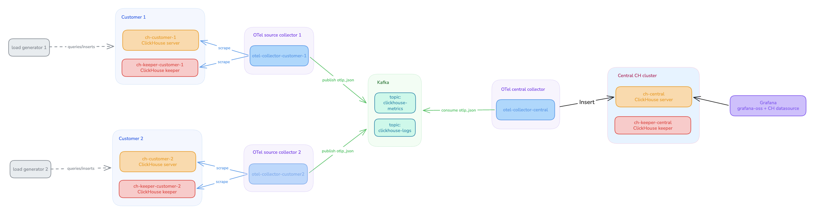

# ClickHouse OTel Kafka Demo

Multi-tenant observability pipeline: two customer ClickHouse clusters emit
metrics and logs via OTel Collector to Kafka topics and get sent to a central ClickHouse
cluster. Grafana is used to visualize the data.

Everything runs on plain HTTP, no TLS. Local testing only — do not reuse
these credentials anywhere real.

## Architecture



```
Customer Cluster 1                          Central Platform
──────────────────                          ────────────────
ch-keeper-customer-1 ←──── coordination
ch-customer-1        ──┐
                       │ Prometheus scrape        ch-keeper-central ←─ coordination
otel-collector-        │ + sqlquery receiver      ch-central (otel.* schema)
  customer-1    ───────┤                               ▲
                       │ publish OTLP-JSON             │ write OTel schema
                       ▼                          otel-collector-central ◄─── Kafka
                     Kafka                             │
                       ▲                               │ Prometheus scrape
                       │ publish OTLP-JSON             │ (ch-keeper-central)
otel-collector-        │
  customer-2    ───────┤                          Grafana
ch-customer-2        ──┘    (queries otel.* on ch-central)
ch-keeper-customer-2 ←──── coordination

Customer Cluster 2
```

## Repository layout

```
docker-compose.yml

ch-customer-1/
  config.d/
    observability.xml   # Prometheus endpoint, text_log
    keeper.xml          # ClickHouse Keeper connection
  init-scripts/
    01-reader-user.sql  # otel_reader user for the OTel Collector
    02-sink-schema.sql  # events table used by the load generator

ch-customer-2/          # identical structure to ch-customer-1
  config.d/
    observability.xml
    keeper.xml
  init-scripts/
    01-reader-user.sql
    02-sink-schema.sql

ch-keeper-customer-1/   # Keeper for customer cluster 1
  config.xml

ch-keeper-customer-2/   # Keeper for customer cluster 2
  config.xml

ch-central/             # Keeper for central ClickHouse cluster
  config.d/
    network.xml
    settings.xml
    keeper.xml
  init-scripts/
    01-otel-schema.sql  # full OTel schema (otel.otel_metrics_*, otel.otel_logs)

ch-keeper-central/      # Keeper for central ClickHouse cluster
  config.xml

otel-collector-customer-1/
  config.yaml           # scrapes ch-customer-1 + ch-keeper-customer-1 and sends to Kafka

otel-collector-customer-2/
  config.yaml           # scrapes ch-customer-2 + ch-keeper-customer-2 and sends to Kafka

otel-collector-central/
  config.yaml           # OTEL collector reads Kafka topics and sends to ch-central

grafana/                # Comes with a dashboard and a datasource that connects to the central ClickHouse cluster
  provisioning/
    datasources/clickhouse.yaml
    dashboards/dashboards.yaml
  dashboards/
    ch-cluster-v2.json
```

## Run it

```bash
podman compose up -d
```

First startup takes a couple of minutes — ClickHouse runs init scripts,
Kafka elects itself as its own KRaft controller, and the collectors wait
on both via healthchecks.

## Access Grafana

**Grafana** — http://localhost:3000, login `admin` / `admin`. Allow 30–60 seconds after
`docker compose up` for the first rows to appear (collector poll interval +
Kafka round trip).

**Collector logs:**

```bash
podman compose logs -f otel-collector-customer-1
podman compose logs -f otel-collector-customer-2
podman compose logs -f otel-collector-central
```

**Query the sink directly:**

```bash
# metrics landing in ch-central
podman exec -it ch-poc-ch-central clickhouse-client --password clickhouse \
  --query "SELECT ServiceName, MetricName, count() FROM otel.otel_metrics_gauge GROUP BY ServiceName, MetricName ORDER BY ServiceName, MetricName LIMIT 20"

# logs
podman exec -it ch-poc-ch-central clickhouse-client --password clickhouse \
  --query "SELECT ServiceName, count() FROM otel.otel_logs GROUP BY ServiceName"
```

**Raw Kafka topics:**

```bash
podman exec -it ch-poc-kafka /opt/kafka/bin/kafka-console-consumer.sh \
  --bootstrap-server localhost:9092 --topic clickhouse-metrics --max-messages 3

podman exec -it ch-poc-kafka /opt/kafka/bin/kafka-console-consumer.sh \
  --bootstrap-server localhost:9092 --topic clickhouse-logs --max-messages 3
```

## Tear down

```bash
podman compose down -v   # -v also removes all named volumes
```

## Known rough edges (POC only)

- Passwords are hardcoded in plain text across config files — change one,
  change them all.
- `opentelemetry_start_trace_probability = 1` (100% sampling) is set in the
  default profile — fine for a low-traffic demo, very expensive on real
  workloads.
- Single Kafka node, single partition, no replication.
- Init scripts only run against an empty data directory. If you restart a
  ClickHouse container without `-v`, they will not re-run — this is expected.
